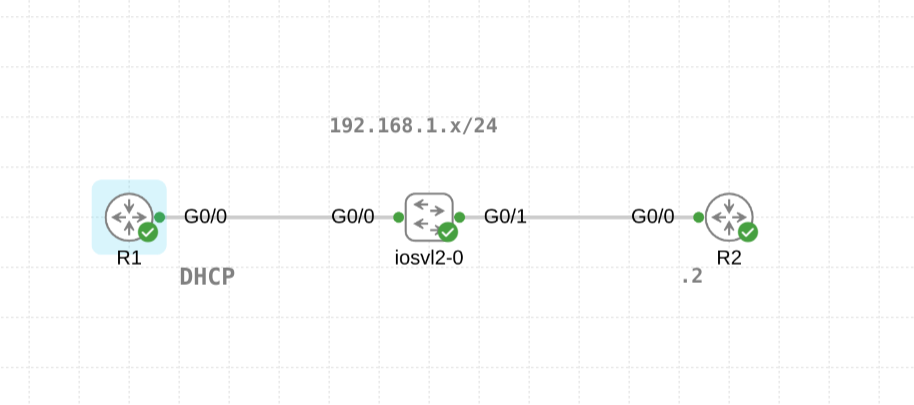
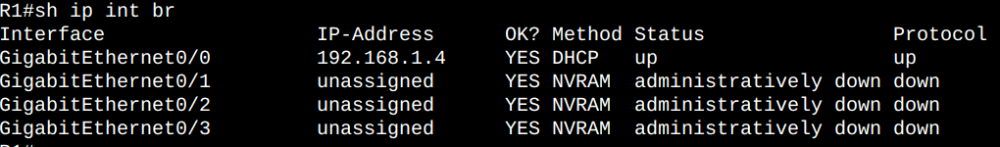

# Configuring DHCP on a Router

## Overview
In this lab, I configured a router as a DHCP server, which dynamically assigns an IP address to another router acting as a DHCP Client. This simulates a real-world scenario where a router provides IP address dynamically to other network devices.

## Lab Topology
Below is the toplogy used for the lab:



## Configuration Steps

### Step 1: Configure R2 as a DHCP Server

```bash
R2(config)#int g0/0
R2(config-if)#ip address 192.168.1.2 255.255.255.0
R2(config-if)#no shut
R2(config-if)#exit                                
R2(config)#ip dhcp pool pool1
R2(dhcp-config)#network 192.168.1.0 /24
R2(dhcp-config)#default-router 192.168.1.2
R2(dhcp-config)#dns-server 8.8.8.8
R2(dhcp-config)#lease 7 12
R2(dhcp-config)#exit
R2(config)#ip dhcp excluded-address 192.168.1.1 
```

ip dhcp excluded-address is used to exclude ip addresses from the DHCP pool.
default-router and dns-server provide default gateway and DNS server information to clients.


### Step 2: Configure R1 as a DHCP Client

```bash

R1(config)#int g0/0
R1(config-if)#ip address dhcp
```

ip address dhcps allowes R1 to automatically receive an IP address from R2 (DHCP Server)


### Step 3: Verify the DHCP configuration

```bash

R1#show ip interface brief

```




